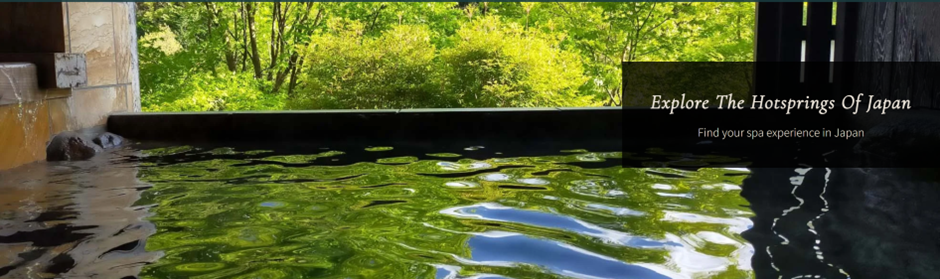
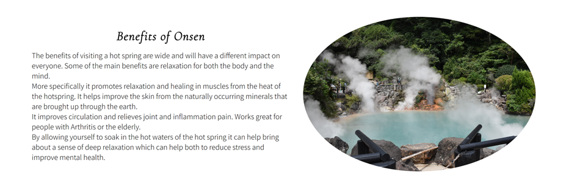
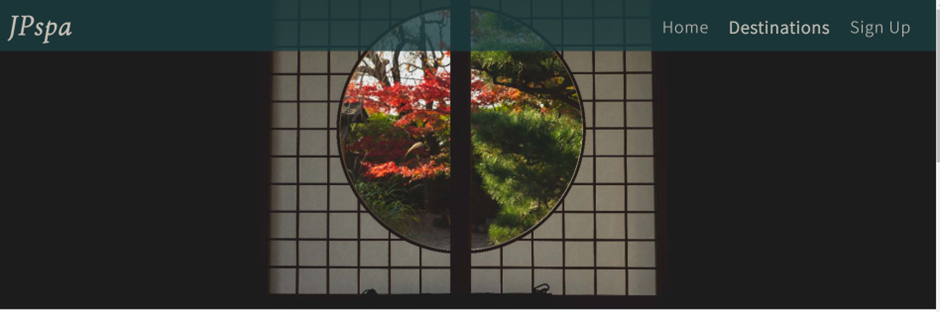
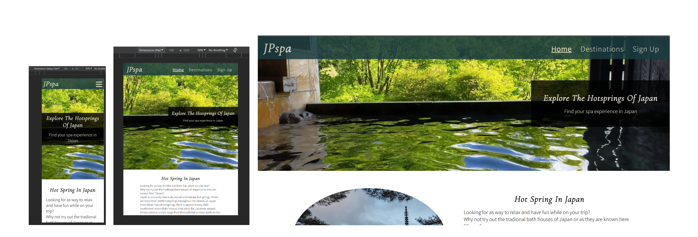
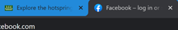
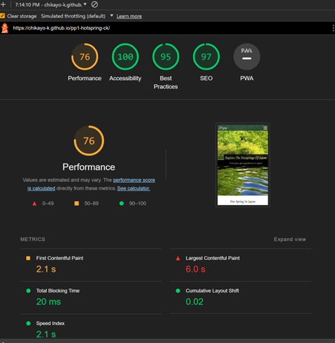
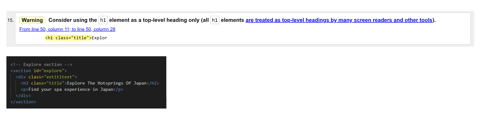

# JPspa

JPspa is a new and exciting platform that is designed to connect travelers coming to or already in Japan with one of our most sensational experiences.

Onsen!! Onsen are specialized baths built around natural hot springs. 
JPspa will help those planning a visit to Japan in the future, as well as those already traveling in the country and seeking out new and exciting experiences. 
The JPspa aims to promote onsen in Japan for their health benefits not just for the body but also for the mind.  
JPspa will offer excellent discount vouchers for different onsen in Japan on a rotating basis as well as provide a weekly newsletter with information about the onsen and their location. 
(JPspa will get a commission if users go through our partner websites)

## Existing Features

**Navigation Bar**

- The site uses a responsive navigation bar made up of three pages these are the Home page, Destination, and Signup pages. It also contains a logo. The logo and Home can be used to navigate to the top of the home page. Destinations, and Sign Up navigate to their relevant pages.

- A user can access the other pages on the site and see what page they are currently on by looking at the menu in the navigation bar. When the user is on a page it will show that in bold text.

**The landing page image**

- Is a photograph accompanied by a short description and title that gives the users a clear picture of the website's purpose and gives a clear idea of where and what services are provided.

- • This section creates a relaxing image for users, it uses a simple but effective image that encourages further exploration of the site for people who are interested in hot springs in Japan.

**Hot spring in Japan section**

- A brief Introduction to hot springs in Japan and their use as Onsen, accompanied by an image capturing the beauty of Japan.

- In this section, users will learn that hot springs are widespread throughout Japan.

**Benefits of Onsen section**

- Explaining the benefits of Onsen, accompanied by an image of a natural hot spring.
- In This section, users will discover the value of visiting hot springs as well as information on the health benefits for the mind and body.

**Japanese-style hotel section**

- Gives a brief intro to Japanese-style hotels and how they are rooted in the historical traditions of the country. Accompanied by a video that showcases this. The Video is a YouTube video and has the same features.
- This user, will inspired by an amazing video and accompanying description and may contemplate taking further steps to find accommodation in a Japanese-style hotel on their visit.

**Footer**

- The footer contains four social media icons when clicked open in new tabs. The logo acts as a home page button.
- Placing social media icons shows users we have an active presence outside of the website which can help to build our social media presence.

### Destination page

**The destinations page image**

- A photograph of a traditional Japanese shoji window.
- This section’s imagery will give users a glimpse of what a luxurious Japanese-style hotel is like and help them on their way to choose where they want to spend their in Japan.

**Where to go section**

- The title explains this page with a brief introduction.
- User will see what this page is about clearly.

**Map of Japanese Onsen**

- Map that displays hot-spring spots throughout Japan that can be clicked and expanded to provide users with more details.
- This section will allow users to explore our partner hot springs throughout the country and help them decide where in Japan they would love to visit. The map can be zoomed in to see where would be the best place to visit.

**Recomendation section**

- The recommendations section provides information on famous hot springs in Japan. They are connected with our partners for a smoother experience.
- This section is valuable to users as they will be able to find our partner websites easily and find more information for their final decision.

**Sign Up page**

- This is a signup page where users can become members of JPspa. Membership benefits provide users with discount vouchers to our partner Onsens every week sent out in our newsletter. User will be asked to submit their full name, email address, and password.
  

### Feature left to implement

The website could have more pages in the future.
I think it would attract more users to the site if there was a built in booking page. Users can book spa or Japanese-style hotels within the website increasing the value of this website and its throughput.

## Testing

- Tested with different browsers such as Chrome, Firefox, and Safari.
- Tested with different screen sizes using the developer tool (Galaxy Fold, iPad, and my laptop)

- Tested navigation bar. Home, Destinations, and Sign Up pages jump to the respective places when it's clicked.

- Tested all social media links in the footer to ensure they open in a new tab with the correct destination when clicked.

- Tested a logo in the footer which jumps back top of the page.
- Tested all links in the recommendation section on the destinations page to ensure they open in a new tab with the correct destination when clicked.

- Tested the form on the Sign-Up page. All required fields worked and the submission button worked.

### Validator Testing

**HTML**  
All pages have no errors and warnings and have been tested with the [W3C validator](https://validator.w3.org).

**CSS**  
No errors adn warnings and have been tested with the [W3C CSS validator](https://jigsaw.w3.org/css-validator)

**Lighthouse report** 
Analysed this page with Lighthouse. Most of the scores are nearly 100%. 
The performance tag is the better score on a desktop screen. a bit low due to having a YouTube video and a Google Map on this website which has impacted the speed slightly.

Desktop 

Mobile 

## Bugs

**Fixed W3C Vlidator warnings and errors**

- Removed slashes as the website had a warning about having a slash on the void element in the header.

- Some of the closing tags weren’t closed with the same tag and some were wrong places. So fixed them.

- Fixed duplicated ID

- I had a warning for having an h1 tag that wasn’t a top-level heading in the explore section of the landing page. Solved the issue by using a h2 tag instead of an h1 of the place.

- I was using a section tag only to render a picture as a background and got this issue. 
  So I put more content in the destination section.

**Lighthouse report improvement** 
Analyse the website with Lighthouse and had high scores. However, there were still places where I could improve them.

- I was using pictures where their sizes were too big and that caused the issue of the loading speed of the page to be impacted. So I compressed the images to be smaller size by converting the images to a WEBP format. This decreased the image size. Some of the pictures also used Photoshop to decrease the pixels.
- Used aspect ratio property in CSS to remove the issue that the images didn’t have a correct height.

## Deployment procedure

## Credits

## Media
