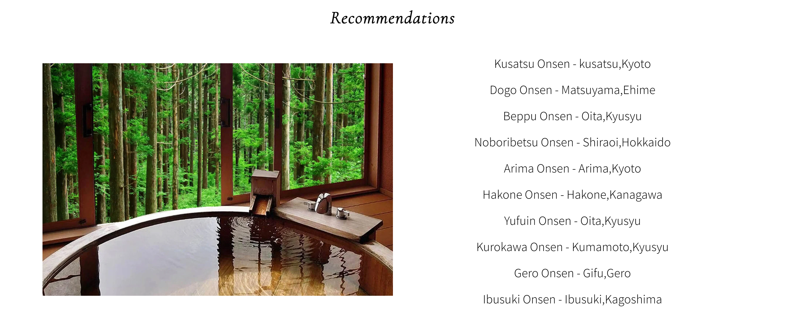
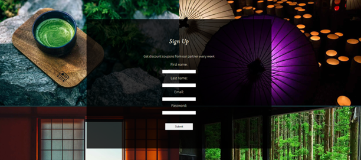

# JPspa

JPspa is a platform designed to connect travelers coming to Japan with incredible hot spring experiences. 
The site caters to those planning a visit to Japan in the near future, as well as those already in the country seeking new and exciting experiences. JPspa aims to promote the use of onsens throughout Japan for both relaxation and health benefits. 
To engage and encourage people to use JPspa, we will provide excellent discount vouchers for select onsens throughout Japan and keep subscribers updated with informative newsletters.  JPspa will also be able to get a commission if the users go through our partner websites to book.

## Existing Features

**Navigation Bar**

- The site contains a responsive navigation bar made up of three pages the Logo, Home page, Destination, and Signup pages. The logo and Home can be used to navigate to the home page while the Destinations, and Sign Up pages navigate to their respective pages.

- Users can easily access the other pages and see which page they are on this has been done by expanding the font when the mouse is hovering.

**The landing page image**

- A photograph accompanied by a descriptive title gives the users a clear understanding of the website's intended purpose and gives the user a clear idea of where the service is provided.

- This section creates a pleasant and relaxing atmosphere for users, it uses a simple but effective image that encourages further exploration of the site for people who are interested in the topic.

**Hot spring in Japan section**

- Introduction and explanation of hot springs in Japan and their use as Onsen, accompanied by an image capturing the essence of Japan.

- In This section, users will understand that hot springs are famous in Japan, leading them to consider visiting these places while in the country.

**Benefits of Onsen section**

- Explaining the benefits of Onsen, accompanied by an image of a natural hot spring.
- In This section, users will discover the value of visiting hot springs by providing them with information on the benefits for the mind and body.

**Japanese-style hotel section**

- Explains how Japanese-style hotels are amazing and how they are rooted in traditions accompanied by a video that showcases these details. The video is clickable allowing users to start and stop it at their convenience.
- This user, will inspired by an amazing video and accompanying description and may contemplate taking further steps to find accommodation in a Japanese-style hotel on their visit.

**Footer**

- The footer section has four social media icons linking to their respective sites. All the links open in new tabs. Also, the logo has a feature that allows users to jump to the top of the page.
- Placing social media icons captures the attention of users and encourages them to explore more details with their respective sites.

  

### Destination page

**The destinations page image**

- A photograph of a traditional Japanese shoji window.
- This section’s imagery will allow users to imagine what a luxury Japanese-style hotel is like and help them choose where they want to make their memories while in Japan.

**Where to go section**

- The title explains this page with a brief introduction
- User will see what this page is about clearly

**Map of Japanese Onsen**

- Map that displays hot-spring spots in Japan that can be clicked and users can find more details.
- This section will allow users to explore our partner hot springs throughout the country and help them decide where in Japan they would love to visit. The map can be zoomed in to see where would be the best place to visit.

**Recomendation section**

- The recommendations section provides information on famous hot springs in Japan. They are all linked to our partner's websites and open up in a new tab.
- This section is valuable to users as they will be able to find our partner websites easily and find more information for their final decision.

**Sign Up page**

- This page allows users to sign up to be a member of JPspa. Membership benefits are we provide discount vouchers to our partner Onsens every week sent out in our newsletter. User will be asked to submit their full name, email address, and password.

